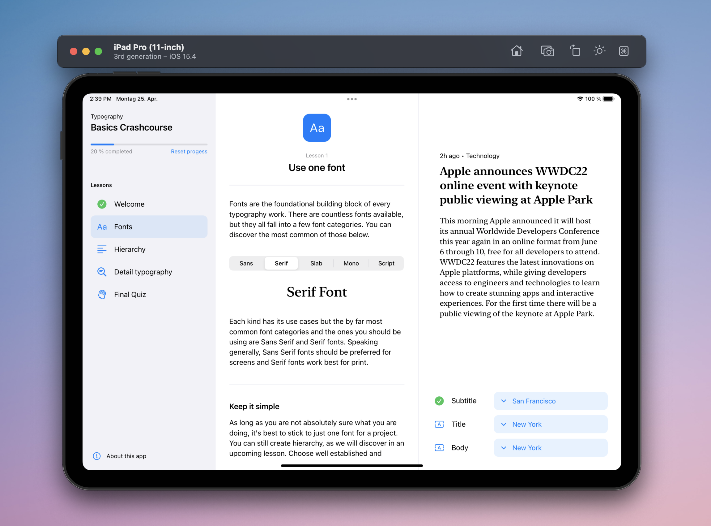
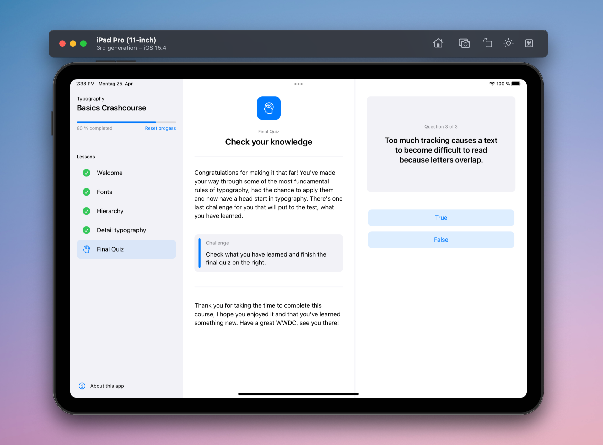

# WWDC22 Swift Student Challenge Submission

An educational iPad app teaching some fundamental rules of typography in a fun and interactive way. Created as a submission to the 2022 Apple Swift Student Challenge by Henri Bredt in April 2022.

|  |  |
--- | ---

The app is diveded into three areas: a navigation bar (left), a content view for explaining the concepts (center) and a playground view, where the user can apply what he has learned in an interactive view (right). Every lesson challenges the user to accomplish a task in the playground view in order to progress through the course.

# Whats next?
As of right now, the app contains a welcome page, three lessons and a final quiz to fit the three-minute time frame for the challenge. I am planning to add a few more lessons (for example about spacing and alignment) in the weeks to come and then publish the app on the app store to help more people make good use of typography. If you'd be interested to join a Beta of the app, send me a [message](https://twitter.com/henricreates).

## Installation 👨🏼‍💻
Download the *Typography - WWDC22.swiftpm* folder to your iPad and open it with the Swift Playgrounds 4 app.
